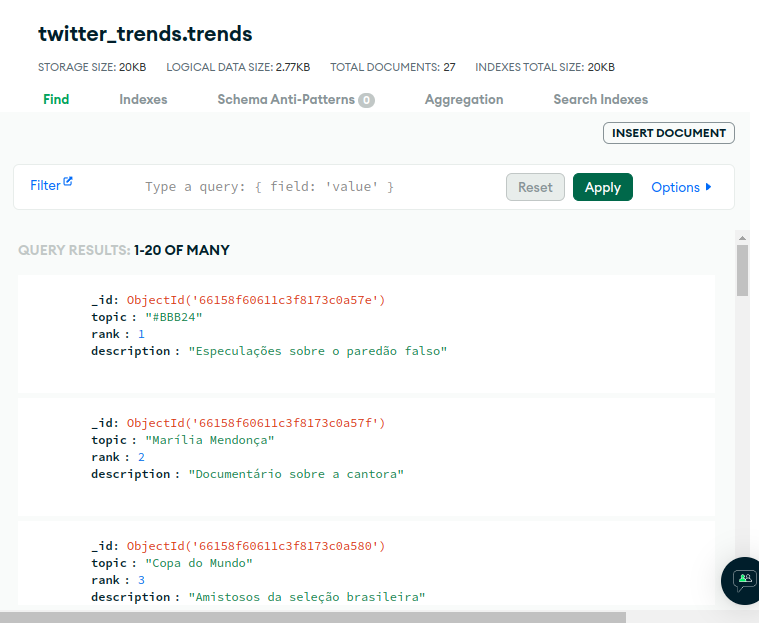
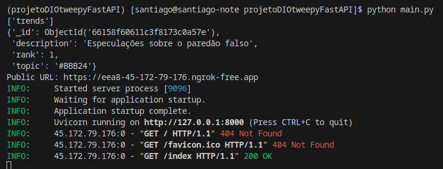
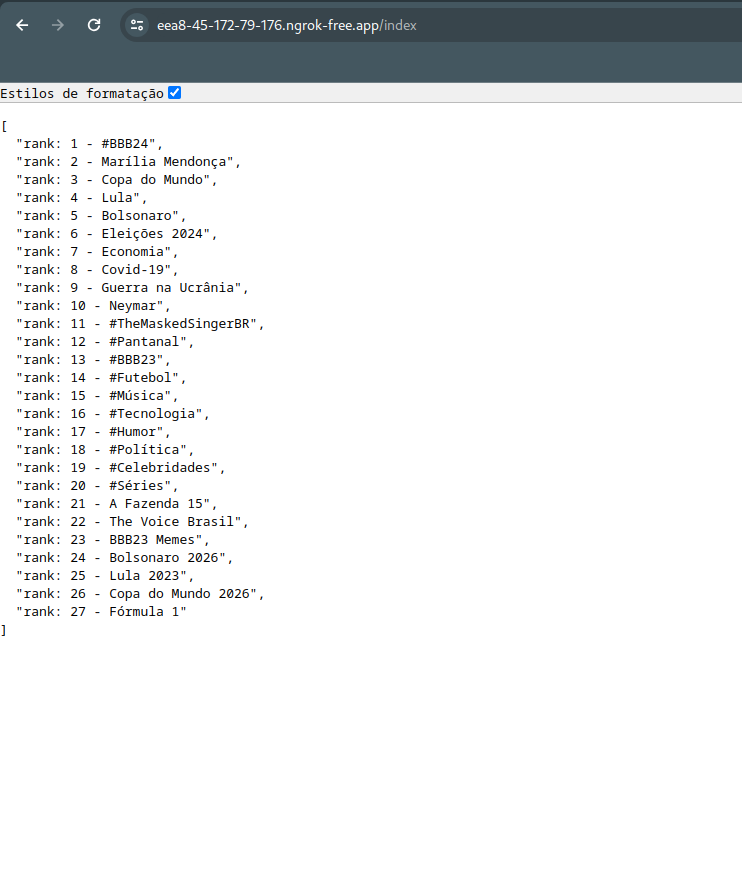

<h1>
    
     Formação Python Developer 
</h1>

# :computer: Consumindo a API do Twitter com Python

Expanda seus conhecimentos sobre Python, Banco de Dados e APIs. Para isso, vamos criar um projeto prático com o objetivo de consumir a API REST do Twitter. Nesse sentido, uma série de boas práticas e dicas foram apresentadas pelo nosso expert. Entre elas o Tweepy, que reduziu a complexidade no consumo da API do Twitter. Agora é a sua hora de brilhar! Reproduza o projeto que criamos, dando a sua cara a ele. Para isso, pense em novas funcionalidades e formas de evoluir a solução:

Criar relatórios/dashboards para exibir de forma mais amigável os dados coletados via Twitter API.
Containerizar a aplicação com Docker e modularizar a aplicação.

# :bulb: Solução do desafio

## :zap:  Tecnologias Utilizadas
- Google Gemini - gerar dados dos treads
- pipenv - controle de versão
- MongoDB Atlas - banco de dados na nuvem
- PyMongo - conexão com banco de dados
- FastAPI - desenvolver a aplicação
- ngrok - executar o app online

## :beetle: Dificuldades com o desafio

O X (twitter) atualizou a API e retirou o acesso para contas gratuitas para a consulta dos treads. Na tentativa de conectar e obter os dados com o Tweepy se obtinha o erro:

tweepy.errors.Forbidden: 403 Forbidden
453 - You currently have access to a subset of Twitter API v2 endpoints and limited v1.1 endpoints (e.g. media post, oauth) only. If you need access to this endpoint, you may need a different access level. You can learn more here: https://developer.twitter.com/en/portal/product

Uma discussão a respeito disso pode ser encontrada em: 
https://stackoverflow.com/questions/76518869/tweepy-errors-forbidden-403-forbidden-issue-with-twitter-api-authentication-u

Dessa forma não foi possível reproduzir o desafio da forma apresentada. 

## :thought_balloon: Dados dos trend topics gerados usando o google Gemini

Para expandir os conhecimentos de Python, banco de dados e APIs, foram usados dados gerados pelo Google Gemini para os trend topics do twitter no Brasil. Com o arquivo pyMongoData.py esses dados foram persistidos no MongoDB Atlas:

Utilizando o ngrok o app rodou com link publico:

E a lista com o rank e os trend topics foram observadas com no navegar. 

